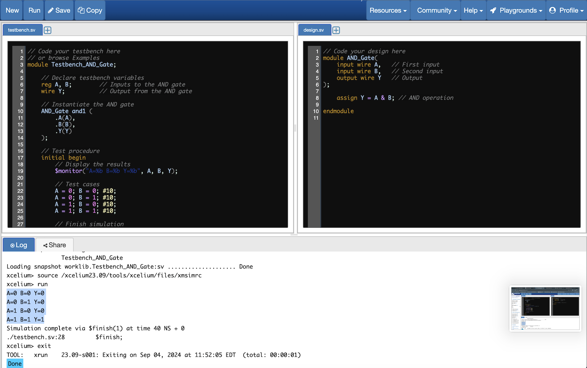
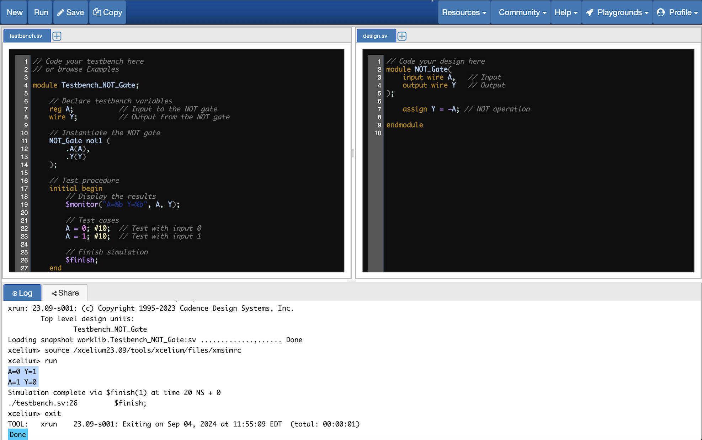
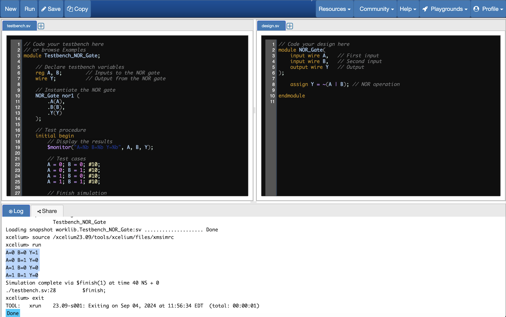

# Basic-Gates
# Basic Logic Gates

Basic logic gates are fundamental building blocks in digital electronics. They perform basic logical functions that are essential for digital circuits. Below is a brief overview of each type of gate:

## 1. AND Gate
- **Symbol**: A flat-ended symbol with two inputs and one output.
- **Function**: The output is high (1) only when all inputs are high (1). 
- **Truth Table**:

  | A | B | Output (A AND B) |
  |---|---|------------------|
  | 0 | 0 | 0                |
  | 0 | 1 | 0                |
  | 1 | 0 | 0                |
  | 1 | 1 | 1                |
```
```
  

## 2. OR Gate
- **Symbol**: A curved-ended symbol with two inputs and one output.
- **Function**: The output is high (1) if at least one of the inputs is high (1).
- **Truth Table**:

  | A | B | Output (A OR B)  |
  |---|---|------------------|
  | 0 | 0 | 0                |
  | 0 | 1 | 1                |
  | 1 | 0 | 1                |
  | 1 | 1 | 1                |

```
```
 

## 3. NOT Gate
- **Symbol**: A triangle with a small circle (inversion symbol) at the output.
- **Function**: The output is the inverse of the input. If the input is high (1), the output is low (0), and vice versa.
- **Truth Table**:

  | A | Output (NOT A) |
  |---|----------------|
  | 0 | 1              |
  | 1 | 0              |

```
```
 

## 4. NAND Gate
- **Symbol**: An AND gate symbol with a small circle at the output.
- **Function**: The output is high (1) unless all inputs are high (1). It’s the inverse of the AND gate.
- **Truth Table**:

  | A | B | Output (A NAND B) |
  |---|---|-------------------|
  | 0 | 0 | 1                 |
  | 0 | 1 | 1                 |
  | 1 | 0 | 1                 |
  | 1 | 1 | 0                 |

```
```
 

## 5. NOR Gate
- **Symbol**: An OR gate symbol with a small circle at the output.
- **Function**: The output is high (1) only when all inputs are low (0). It’s the inverse of the OR gate.
- **Truth Table**:

  | A | B | Output (A NOR B) |
  |---|---|------------------|
  | 0 | 0 | 1                |
  | 0 | 1 | 0                |
  | 1 | 0 | 0                |
  | 1 | 1 | 0                |

```
```
 

## 6. XOR Gate
- **Symbol**: An OR gate symbol with an additional curved line before the input lines.
- **Function**: The output is high (1) when the number of high inputs is odd.
- **Truth Table**:

  | A | B | Output (A XOR B) |
  |---|---|------------------|
  | 0 | 0 | 0                |
  | 0 | 1 | 1                |
  | 1 | 0 | 1                |
  | 1 | 1 | 0                |

```
```
 

## 7. XNOR Gate
- **Symbol**: An XOR gate symbol with a small circle at the output.
- **Function**: The output is high (1) when the number of high inputs is even. It’s the inverse of the XOR gate.
- **Truth Table**:

  | A | B | Output (A XNOR B) |
  |---|---|-------------------|
  | 0 | 0 | 1                 |
  | 0 | 1 | 0                 |
  | 1 | 0 | 0                 |
  | 1 | 1 | 1                 |

```
```
 

These gates form the basis of digital circuits, used to build more complex logic functions and systems.
